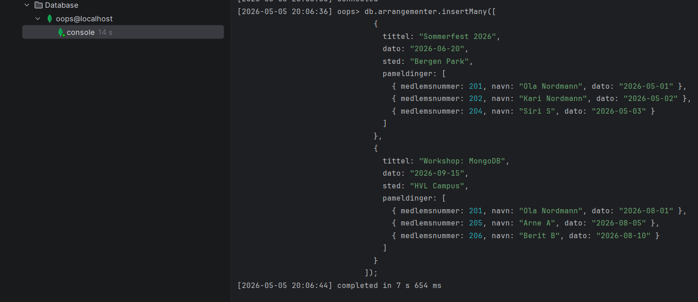
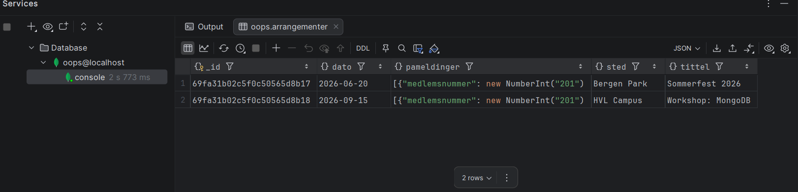

# Oblig 4, DAT107

## Medlemmer og gruppenummer

**Gruppenummer:** 32

| Navn                          | Stud_id | Github brukernavn                                    |
| ----------------------------- | ------- | ---------------------------------------------------- |
| Bartosz Arkadiusz Paszkiewicz | 679414  | [@Paszkiewicz](https://github.com/paszkiewicz)       |
| Daniel Aarsand                | 194916  | [@Aarsand](https://github.com/Aarsand)               |
| Lars Birger Bergmål           | 583411  | [@larsbirger](https://github.com/larsbirger)         |
| Markus Fosse Høvring          | 194918  | [@Markus-Hovring](https://github.com/Markus-Hovring) |

---

## Oppgave 4.1 a - XML Dokument

Filnavn: `lokallag.xml`

```xml
<?xml version="1.0" encoding="UTF-8"?>
<lokallag xmlns:xsi="http://www.w3.org/2001/XMLSchema-instance"
          xsi:noNamespaceSchemaLocation="lokallag.xsd">
    <lag>
        <info>
            <navn>lyn</navn>
            <lokale>Lyn klubbhus</lokale>
            <adresse>Olav M. Troviks vei 13</adresse>
        </info>
        <leder>
            <navn>
                <fornavn>ola</fornavn>
                <etternavn>nordmann</etternavn>
            </navn>
        </leder>
        <medlemmer>
            <medlem mId="1">
                <navn>
                    <fornavn>ola</fornavn>
                    <etternavn>nordmann</etternavn>
                </navn>
                <kontakt>
                    <telefon>9434567</telefon>
                    <epost>ola@nordmann.no</epost>
                </kontakt>
                <adresse>
                    <gateadresse>gateadressen 2</gateadresse>
                    <postnummer>0800</postnummer>
                    <poststed>oslo</poststed>
                </adresse>
                <erAktiv>true</erAktiv>
                <avgifter>
                    <avgift aNr="1">
                        <aar>2000</aar>
                        <erBetalt>true</erBetalt>
                        <dato>2000-03-03T20:20:46</dato>
                    </avgift>
                    <avgift aNr="2">
                        <aar>2001</aar>
                        <erBetalt>true</erBetalt>
                        <dato>2001-03-03T20:20:46</dato>
                    </avgift>
                    <avgift aNr="3">
                        <aar>2002</aar>
                        <erBetalt>true</erBetalt>
                        <dato>2002-03-03T20:20:46</dato>
                    </avgift>
                </avgifter>
            </medlem>

            <medlem mId="2">
                <navn>
                    <fornavn>kari</fornavn>
                    <etternavn>nordame</etternavn>
                </navn>
                <kontakt>
                    <telefon>1234567</telefon>
                    <epost>kari@nordame.no</epost>
                </kontakt>
                <adresse>
                    <gateadresse>heivegen 2</gateadresse>
                    <postnummer>0010</postnummer>
                    <poststed>oslo</poststed>
                </adresse>
                <erAktiv>true</erAktiv>
                <avgifter>
                    <avgift aNr="1">
                        <aar>2001</aar>
                        <erBetalt>true</erBetalt>
                        <dato>2001-03-03T20:20:46</dato>
                    </avgift>
                    <avgift aNr="2">
                        <aar>2002</aar>
                        <erBetalt>true</erBetalt>
                        <dato>2002-03-03T20:20:46</dato>
                    </avgift>
                    <avgift aNr="3">
                        <aar>2003</aar>
                        <erBetalt>true</erBetalt>
                        <dato>2003-03-03T20:20:46</dato>
                    </avgift>
                </avgifter>
            </medlem>

            <medlem mId="3">
                <navn>
                    <fornavn>harald</fornavn>
                    <etternavn>kongen</etternavn>
                </navn>
                <kontakt>
                    <telefon>0000001</telefon>
                    <epost>harald@rex.no</epost>
                </kontakt>
                <adresse>
                    <gateadresse>slottsplassen 1</gateadresse>
                    <postnummer>0011</postnummer>
                    <poststed>oslo</poststed>
                </adresse>
                <erAktiv>true</erAktiv>
                <avgifter>
                    <avgift aNr="1">
                        <aar>2002</aar>
                        <erBetalt>true</erBetalt>
                        <dato>2002-03-03T20:20:46</dato>
                    </avgift>
                    <avgift aNr="2">
                        <aar>2003</aar>
                        <erBetalt>true</erBetalt>
                        <dato>2003-03-03T20:20:46</dato>
                    </avgift>
                    <avgift aNr="3">
                        <aar>2004</aar>
                        <erBetalt>true</erBetalt>
                        <dato>2004-03-03T20:20:46</dato>
                    </avgift>
                </avgifter>
            </medlem>
        </medlemmer>
    </lag>
</lokallag>
```

---

## Oppgave 4.1 b - XML Skjema

Filnavn: `lokallag.xsd`

```xml
<?xml version="1.0" encoding="UTF-8"?>
<xs:schema xmlns:xs="http://www.w3.org/2001/XMLSchema"
           elementFormDefault="qualified">

    <xs:element name="lokallag" type="lokallagType">
        <xs:unique name="mIdUnique">
            <xs:selector xpath="lag/medlemmer/medlem"/>
            <xs:field xpath="@mId"/>
        </xs:unique>
    </xs:element>

    <xs:complexType name="lokallagType">
        <xs:sequence>
            <xs:element name="lag" type="lagType" minOccurs="1" maxOccurs="unbounded"/>
        </xs:sequence>
    </xs:complexType>

    <xs:complexType name="lagType">
        <xs:sequence>
            <xs:element name="info" type="infoType"/>
            <xs:element name="leder" type="lederType"/>
            <xs:element name="medlemmer" type="medlemmerType"/>
        </xs:sequence>
    </xs:complexType>

    <xs:complexType name="infoType">
        <xs:sequence>
            <xs:element name="navn" type="xs:string"/>
            <xs:element name="lokale" type="xs:string"/>
            <xs:element name="adresse" type="xs:string"/>
        </xs:sequence>
    </xs:complexType>

    <xs:complexType name="lederType">
        <xs:sequence>
            <xs:element name="navn" type="navnType"/>
        </xs:sequence>
    </xs:complexType>

    <xs:complexType name="medlemType">
        <xs:sequence>
            <xs:element name="navn" type="navnType"/>
            <xs:element name="kontakt" type="kontaktType"/>
            <xs:element name="adresse" type="adresseType"/>
            <xs:element name="erAktiv" type="xs:boolean"/>
            <xs:element name="avgifter" type="avgifterType"/>
        </xs:sequence>
        <xs:attribute name="mId" type="xs:positiveInteger" use="required"/>
    </xs:complexType>

    <xs:complexType name="navnType">
        <xs:sequence>
            <xs:element name="fornavn" type="xs:string"/>
            <xs:element name="etternavn" type="xs:string"/>
        </xs:sequence>
    </xs:complexType>

    <xs:complexType name="kontaktType">
        <xs:sequence>
            <xs:element name="telefon" type="xs:string"/>
            <xs:element name="epost" type="xs:string"/>
        </xs:sequence>
    </xs:complexType>

    <xs:complexType name="adresseType">
        <xs:sequence>
            <xs:element name="gateadresse" type="xs:string"/>
            <xs:element name="postnummer">
                <xs:simpleType>
                    <xs:restriction base="xs:integer">
                        <xs:pattern value="[0-9]{4}"/>
                    </xs:restriction>
                </xs:simpleType>
            </xs:element>
            <xs:element name="poststed" type="xs:string"/>
        </xs:sequence>
    </xs:complexType>

    <xs:complexType name="avgifterType">
        <xs:sequence>
            <xs:element name="avgift" type="avgiftType" minOccurs="1" maxOccurs="unbounded"/>
        </xs:sequence>
    </xs:complexType>

    <xs:complexType name="avgiftType">
        <xs:sequence>
            <xs:element name="aar">
                <xs:simpleType>
                    <xs:restriction base="xs:integer">
                        <xs:minInclusive value="1900"/>
                        <xs:maxInclusive value="2100"/>
                    </xs:restriction>
                </xs:simpleType>
            </xs:element>
            <xs:element name="erBetalt" type="xs:boolean"/>
            <xs:element name="dato" type="xs:dateTime"/>
        </xs:sequence>
        <xs:attribute name="aNr" type="xs:positiveInteger" use="required"/>
    </xs:complexType>

    <xs:complexType name="medlemmerType">
        <xs:sequence>
            <xs:element name="medlem" type="medlemType" minOccurs="1" maxOccurs="unbounded"/>
        </xs:sequence>
    </xs:complexType>
</xs:schema>
```

---

## Oppgave 4.1 c - PostgreSQL XML Spørring

```sql
SELECT xmlelement(name "aktive-medlemmer",
    xmlagg(
        xmlelement(name "medlem",
            xmlattributes(m.medlemsnummer as "mld"), -- Krav: "mld" attributt 
            xmlelement(name "fornavn", m.fornavn), -- Krav: fornavn 
            xmlelement(name "etternavn", m.etternavn), -- Krav: etternavn 
            (SELECT xmlelement(name "avgift-2026", -- Krav: <avgift-gjeldende år> 
                xmlattributes(
                    ma.betalt as "betalt", -- Krav: "betalt" attributt (J/N) [cite: 157]
                    CASE 
                        WHEN ma.betalt = 'J' THEN ma.betalingsdato 
                        ELSE NULL 
                    END as "betalingsdato" -- Krav: vises kun hvis betalt [cite: 157]
                )
            )
            FROM medlemsavgift ma 
            WHERE ma.medlemsnummer = m.medlemsnummer 
            AND ma.ar = EXTRACT(YEAR FROM CURRENT_DATE))
        )
    )
)
FROM medlem m
WHERE m.aktiv = 'J' AND m.lokallag_id = 1; -- Krav: Aktive medlemmer i gitt lokallag
```

---

## Oppgave 4.2 a - JSON Dokument

Filnavn: `lokallag.json`

```json
{
  "lagnavn": "Bergen Kodeklubb",
  "motelokale": {
    "gateadresse": "Lars Hilles gate 30",
    "postnummer": "5008",
    "poststed": "Bergen"
  },
  "leder": {
    "navn": "Lise Lotte",
    "mld": 101
  },
  "medlemmer": [
    {
      "mld": 201,
      "navn": { "fornavn": "Ola", "etternavn": "Nordmann" },
      "kontaktinfo": { "telefon": "99887766", "epost": "ola@test.no" },
      "adresse": { "gateadresse": "Storgata 1", "postnummer": "5003", "poststed": "Bergen" },
      "status": "aktiv",
      "medlemsavgifter": [
        { "ar": 2024, "betalt": "J", "betalingsdato": "2024-02-01" },
        { "ar": 2025, "betalt": "J", "betalingsdato": "2025-01-15" },
        { "ar": 2026, "betalt": "N" }
      ]
    }
  ]
}
```

---

## Oppgave 4.2 b - PostgreSQL JSON Spørring

```sql
SELECT json_build_object(
    'aktive-medlemmer', json_agg(
        json_build_object(
            'mld', m.medlemsnummer,
            'fornavn', m.fornavn,
            'etternavn', m.etternavn,
            'avgift_status', (
                SELECT json_build_object(
                    'betalt', ma.betalt,
                    'betalingsdato', CASE WHEN ma.betalt = 'J' THEN ma.betalingsdato ELSE NULL END
                )
                FROM medlemsavgift ma
                WHERE ma.medlemsnummer = m.medlemsnummer
                AND ma.ar = EXTRACT(YEAR FROM CURRENT_DATE)
            )
        )
    )
)
FROM medlem m
WHERE m.aktiv = 'J' AND m.lokallag_id = 1;
```

---

## Oppgave 4.3 a - Valg av NoSQL

Jeg ville valgt **MongoDB**.
**Begrunnelse:** MongoDB er en dokumentorientert database som er svært velegnet for denne typen applikasjon. Den støtter nøstede objekter, noe som gjør det enkelt å lagre påmeldinger direkte inne i et arrangement eller medlemsavgifter inne i et medlem.

* **Redis** er en nøkkel-verdi database som er for enkel for komplekse spørringer.
* **Cassandra** er laget for enorme datamengder og høy skalerbarhet, men er mindre fleksibel på datamodellering enn MongoDB.
* **Neo4j** er en grafdatabase, som er bra for relasjoner, men kanskje unødvendig komplisert for en enkel påmeldingsløsning.

## Oppgave 4.3 b - Datamodell (MongoDB)

Jeg velger å bruke **Embedding** for påmeldinger. Hvert dokument i samlingen `arrangementer` inneholder en liste over påmeldte medlemmer.
**Begrunnelse:** Dette gjør at vi kan hente all informasjon om et arrangement og hvem som er påmeldt i én enkelt leseoperasjon, noe som gir god ytelse for en web-løsning.

## Oppgave 4.3 c - Eksempeldata

```javascript
db.arrangementer.insertMany([
  {
    tittel: "Sommerfest 2026",
    dato: "2026-06-20",
    sted: "Bergen Park",
    pameldinger: [
      { medlemsnummer: 201, navn: "Ola Nordmann", dato: "2026-05-01" },
      { medlemsnummer: 202, navn: "Kari Nordmann", dato: "2026-05-02" },
      { medlemsnummer: 204, navn: "Siri S", dato: "2026-05-03" }
    ]
  },
  {
    tittel: "Workshop: MongoDB",
    dato: "2026-09-15",
    sted: "HVL Campus",
    pameldinger: [
      { medlemsnummer: 201, navn: "Ola Nordmann", dato: "2026-08-01" },
      { medlemsnummer: 205, navn: "Arne A", dato: "2026-08-05" },
      { medlemsnummer: 206, navn: "Berit B", dato: "2026-08-10" }
    ]
  }
]);
```





---

## Oppgave 4.4 - MongoDB Query API

* **a)** `db.medlem.insertOne({_id: 100, fornavn: "Jan", etternavn: "Jansen", lokallag_id: 1, aktiv: "J"});`
* **b)** `db.lokallag.insertMany([{_id: 2, lagnavn: "Oslo"}, {_id: 3, lagnavn: "Trondheim"}]);`
* **c)** `db.lokallag.deleteOne({_id: 3});`
* **d)** `db.lokallag.find();`
* **e)** `db.medlem.find({lokallag_id: 1});`
* **f)** `db.medlem.find({lokallag_id: 1}).sort({_id: 1}).limit(3);`
* **g)** `db.medlem.find({poststed: "Bergen"});`
* **h)** `db.medlem.find({aktiv: "J", medlemsavgifter: {$elemMatch: {ar: 2025, betalt: "J"}}});`
* **i)** `db.medlem.find({$or: [{fornavn: /^A/}, {etternavn: /^J/}]});`
* **j)** `db.medlem.countDocuments({lokallag_id: 1});`
* **k)** `db.medlem.aggregate([{$group: {_id: "$lokallag_id", antall: {$sum: 1}}}]);`
* **l)** `db.medlem.updateMany({lokallag_id: 1}, {$push: {medlemsavgifter: {ar: 2027, betalt: "N"}}});`